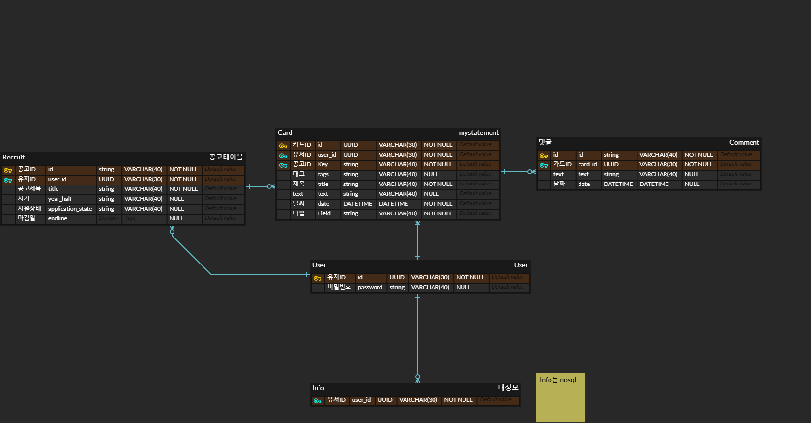

# Javis - 자소서 비서 서비스
클라우드컴퓨팅(AWS) 과제 구현을 위한 javis 프로젝트입니다.
### 진행중
- 프론트 https://github.com/hojin535/javis-front
- 백엔드 https://github.com/hojin535/javis-backend

# 배경

Javis는 자소서 비서 서비스의 줄임말로, 취업 준비자들을 위한 아카이빙 웹 서비스입니다. 취업 준비 과정에서 자소서를 새롭게 작성하거나 기존 자소서를 찾기 힘들어하는 문제를 해결하고자 탄생했습니다.  
취업 준비자들이 자주 경험하는 어려움은 자소서 작성에 필요한 정보나 경험들을 체계적으로 관리하지 못하는 점입니다. 기업들이 요구하는 개인 정보(한자 이름, 취득 자격증, 수상 경력 등)와 자소서 작성에 필요한 다양한 경험들을 한 곳에 아카이빙하고, 이를 쉽게 찾고 활용할 수 있도록 돕는 것이 Javis의 핵심 기능입니다.

# 사용 스택
## 프론트
- React.js
- Recoil
- Material-UI (Mui)
- Styled-Component
- dynamodb
- S3(웹호스팅)

## 백엔드
- node.js
- DynamoDB
- RDS
### 다이어그램

## AWS 제한 사항
- Amazon Cloud Front
- Route 53
- 예산 50$
## AWS 다이어그램

# 소감, 느낀점

매번 프론트엔드 프로젝트만 하다가 백엔드와 AWS 아키텍처까지 구축하니 흥미로웠다. 
AWS는 학교 수업을 듣고 한 프로젝트라 쉬울 줄 알았지만, 제한 사항 때문에 대처 방안을 찾느라 꽤 고전했다.  
수업용 러너 랩이라 **Route 53**과 **Amazon CloudFront**가 막혀 있었고, 프론트와 백엔드에 HTTPS와 DNS 설정을 하고 싶었다.

대안으로 백엔드 로드밸런서의 DNS CNAME 레코드를 외부 DNS 서버 회사 사이트에서 등록 후 연결하였고,  
SSL 인증도 외부 사이트에서 인증 받은 후 **AWS Certificate Manager**를 통해 외부 인증서를 가져와 로드밸런서에 연결해 주었다.  

S3의 경우, CloudFront가 막혀 있어 웹호스팅 엔드포인트가 HTTPS 인증을 받을 수 없었다.  
대안으로 프록시 서버를 하나 두고 DNS와 인증을 받으려 했는데, 그럴 경우 프록시 서버에 장애가 생기면 접속할 수 없어서 S3의 고가용성과 확장성이라는 장점이 사라진다고 생각했다.  
그래서 프록시 서버에도 **로드밸런싱**과 **오토스케일링**을 사용하였다.

금액적인 부분도 50달러를 넘으면 해당 계정에 접속이 불가했기때문에 글로벌 서비스인 s3와 dynamoDB에 **게이트웨이 엔드포인트**를 적용했다.
 제한된 상황에서 문제점이나 대안을 찾고 해결해 나가는 점도 재밌었고 특히 온프레미스나 로컬환경에서는 알지 못했을 비용 절감부분에 대해서
좋은 경험이 된거 같다.
